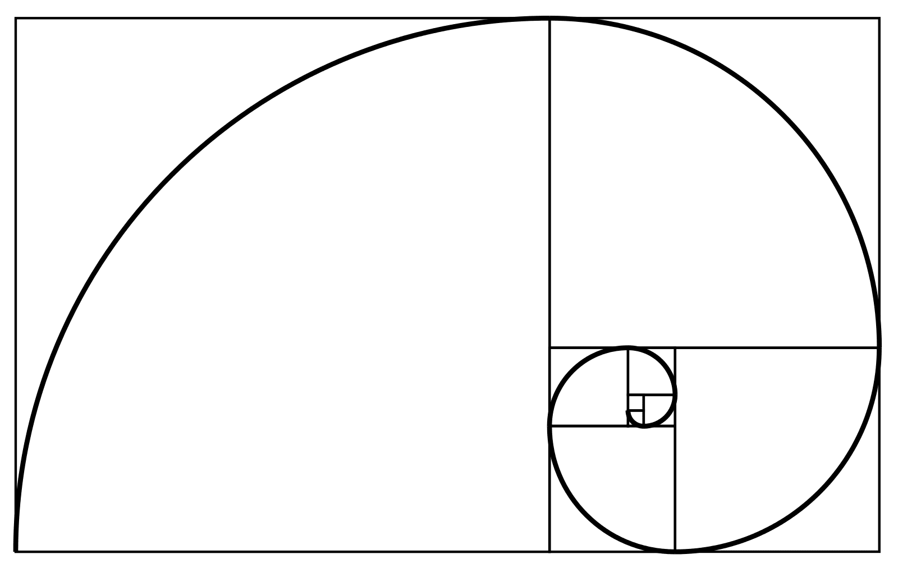
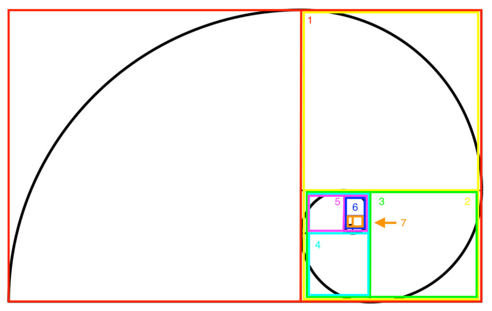
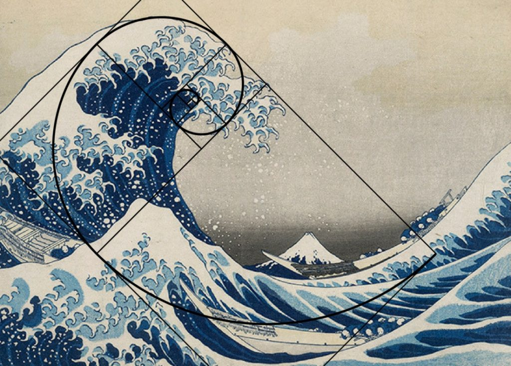
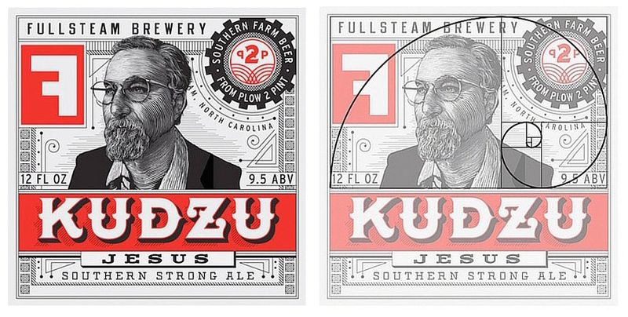

<div align="center">


</div>

<h1 align="center">Divina — Design Analysis Toolkit</h1>

<p align="center">
  <strong>Golden ratio overlays, composition grids, a proportion calculator, and AI-powered design scoring — all in your browser.</strong>
</p>

<div align="center">


</div>

---

## What is Divina?

Divina is a browser extension that helps designers, developers, and artists **analyze any web page** against classical design principles. Overlay the golden spiral on a hero section, check if a card's proportions hit the golden ratio, or let AI score an entire page across seven design criteria — without leaving your browser.

---

## The Golden Ratio — The Math Behind Divina

At the heart of Divina is **Phi (φ)** — the golden ratio:

```
        a + b       a
  φ  =  ─────  =  ───  =  1.6180339887...
          a        b
```

Two quantities are in the golden ratio when their ratio equals the ratio of their sum to the larger quantity. This proportion appears throughout nature, art, and architecture.

### Core Constants

| Constant | Value | Description |
|----------|-------|-------------|
| **PHI (φ)** | `1.6180339887498948` | The golden ratio |
| **PHI_INV (1/φ)** | `0.6180339887498950` | Inverse of phi — also equal to φ − 1 |
| **TOLERANCE** | `0.05` (5%) | Maximum deviation to classify a ratio as "golden" |

### How Ratio Detection Works

```
  deviation = |ratio − φ| / φ

  if deviation ≤ 5%  →  Golden Ratio ✓
  if deviation > 5%  →  Not Golden   ✗
```

**Example:** A card measuring `1618 × 1000` pixels:

```
  ratio     = 1618 / 1000 = 1.618
  deviation = |1.618 − 1.618034| / 1.618034 = 0.002%  ✓  GOLDEN
```

### The Fibonacci Spiral Construction

Divina generates the golden spiral by recursively subdividing a rectangle into Fibonacci-proportioned squares:

```
  ┌─────────────────────────────┬──────────────────┐
  │                             │                  │
  │                             │       1 (φ²)     │
  │                             │                  │
  │          0 (φ³)             ├────────┬───┬──┬──┤
  │                             │        │ 5 │6 │  │
  │                             │   3    ├───┤──┤7 │
  │                             │  (φ)   │   │  │  │
  │                             ├────────┤ 4 ├──┘  │
  │                             │        │(1)│     │
  │                             │ 2 (φ²) │   │     │
  └─────────────────────────────┴────────┴───┴─────┘
```

Each iteration carves a square from the remaining rectangle, cycling through four directions:

```
  Iteration 0  →  RIGHT     Arc center: Top-Left
  Iteration 1  →  BOTTOM    Arc center: Top-Right
  Iteration 2  →  LEFT      Arc center: Bottom-Right
  Iteration 3  →  TOP       Arc center: Bottom-Left
  Iteration 4  →  RIGHT     (cycle repeats...)
```

Quarter-circle arcs inscribed in each square connect to form the continuous **golden spiral**:

<div align="center">



*The golden spiral formed by quarter-circle arcs in Fibonacci rectangles*

</div>

<div align="center">



*8 nested Fibonacci rectangles — each color marks one iteration*

</div>

---

## Features

### 1. Six Overlay Modes

| # | Mode | What it Shows |
|---|------|---------------|
| 1 | **Spiral + Boxes** | Full Fibonacci rectangles with the golden spiral curve |
| 2 | **Boxes Only** | Clean geometric Fibonacci grid without the spiral |
| 3 | **Rule of Thirds** | Classic 3×3 grid with 4 power-point intersections |
| 4 | **Diagonal Grid** | Corner-to-corner diagonals with secondary divisions |
| 5 | **Center + Phi Lines** | Center cross + phi divisions at 38.2% and 61.8% |
| 6 | **Custom PNG** | Upload any reference image as an overlay |

#### Overlay Controls

- **Opacity** — Adjustable from 0% to 100% (default 50%)
- **Rotation** — Snap to 0°, 90°, 180°, or 270°
- **Color** — Any hex color (default: `#DAA520` goldenrod)

### 2. Golden Ratio Calculator

Enter any two dimensions and instantly check if they form a golden ratio:

```
  ┌──────────────────────────────────────┐
  │  Value A:  1920                      │
  │  Value B:  1187                      │
  │                                      │
  │  Ratio:        1.617355              │
  │  Deviation:    0.04%                 │
  │  Verdict:      ✓ GOLDEN RATIO       │
  │                                      │
  │  Suggestions:                        │
  │  • Keep 1187, change A to → 1920    │
  │  • Keep 1920, change B to → 1187    │
  └──────────────────────────────────────┘
```

### 3. AI Design Analyzer

Powered by **Groq** (Llama 4 Scout), the AI analyzer captures a screenshot of the current page and scores it across **7 design criteria**:

| # | Criterion | What it Measures |
|---|-----------|-----------------|
| 1 | **Golden Ratio** | How well layout proportions align with φ |
| 2 | **Typography** | Font hierarchy, sizing, and readability |
| 3 | **Color Contrast** | WCAG-aligned contrast between elements |
| 4 | **Whitespace** | Breathing room and visual balance |
| 5 | **Color Distribution** | Harmony and intentionality of the palette |
| 6 | **Visual Hierarchy** | Clarity of content priority and flow |
| 7 | **Spacing Consistency** | Uniform rhythm across margins and padding |

The analyzer returns:
- An **overall score** (1–10)
- **Individual scores** for each criterion with visual progress bars
- **Actionable suggestions** for improvement
- **Composition guide lines** overlaid directly on the page

---

## Common Design Ratios Reference

Divina focuses on the golden ratio, but here is how φ compares to other common proportions:

```
  Ratio Name              Value       Relationship to φ
  ──────────────────────  ──────────  ──────────────────────
  1:1   (Square)          1.000       φ⁰
  4:3   (Classic TV)      1.333       Close to √φ (1.272)
  √φ    (Phi Square Root) 1.272       √1.618
  3:2   (35mm Film)       1.500       φ − 0.118
  φ     (Golden Ratio)    1.618 ←     THE STANDARD
  16:9  (Widescreen)      1.778       φ + 0.160
  φ²    (Phi Squared)     2.618       φ × φ
  √5    (Root Five)       2.236       φ + 1/φ  (= φ + φ−1)
```

### Phi Division Points

Divina's **"Center + Phi Lines"** mode places guides at these critical positions:

```
         0%      38.2%       50%       61.8%     100%
         │         │          │          │         │
         ├─────────┼──────────┼──────────┼─────────┤
         │         │          │          │         │
         │  ◄──────┤  CENTER  ├──────►   │         │
         │   1/φ   │          │    φ/Σ   │         │
         │ (0.382) │          │  (0.618) │         │
         ├─────────┼──────────┼──────────┼─────────┤
```

The 38.2% / 61.8% split is the golden section — the same proportion that governs Fibonacci sequences, nautilus shells, and Renaissance canvases.

---

## Project Structure

```
Divina-design-guide/
├── manifest.json               # Chrome Extension manifest v3
├── popup/
│   ├── popup.html              # Extension popup — 3 tabs
│   ├── popup.css               # Dark theme UI styles
│   └── popup.js                # Tab logic, controls, AI integration
├── background/
│   └── service-worker.js       # Message routing, script injection, API proxy
├── content/
│   ├── content.js              # Main orchestrator (Shadow DOM)
│   ├── content.css             # Overlay & AI panel styles
│   ├── overlay-manager.js      # Creates/updates/destroys overlays
│   ├── svg-renderer.js         # Builds SVG from golden geometry
│   ├── ai-overlay.js           # AI guide lines & score panel
│   └── drag-resize.js          # Drag & resize handlers
├── lib/
│   ├── golden-ratio-math.js    # Core math: PHI, Fibonacci, geometry
│   └── ai-client.js            # Groq API client
├── icons/                      # Extension icons (16, 48, 128)
├── ratio/                      # Reference diagrams
│   ├── Ratio.png               # Classic Fibonacci spiral
│   └── Eight-1024x648.png     # Colored rectangle iterations
└── examples/                   # Sample design images
    ├── Flower-768x1024.jpg
    ├── Nasa.jpg
    ├── Red.jpg
    └── Wave.jpg
```

---

## Installation

1. Clone or download this repository:
   ```bash
   git clone https://github.com/your-username/Divina-design-guide.git
   ```

2. Open your browser's extension page:
   - **Chrome:** `chrome://extensions`
   - **Edge:** `edge://extensions`

3. Enable **Developer mode** (toggle in top-right corner)

4. Click **"Load unpacked"** and select the `Divina-design-guide` folder

5. Pin the Divina extension (φ icon) to your toolbar

---

## Usage

### Overlay Mode
1. Click the Divina icon in your toolbar
2. Select an overlay mode (Spiral, Thirds, Phi Lines, etc.)
3. Click **Enable Overlay**
4. Adjust opacity, rotation, and color as needed

### Calculator
1. Switch to the **Calculator** tab
2. Enter two values (width & height, or any two measurements)
3. Click **Check Ratio** — see if it's golden and get correction suggestions

### AI Analyzer
1. Switch to the **AI Analyzer** tab
2. Enter your [Groq API key](https://console.groq.com/) and save it
3. Click **Analyze Page**
4. Review scores, suggestions, and composition guides overlaid on the page

---

## Tech Stack

| Layer | Technology |
|-------|-----------|
| Language | Vanilla JavaScript (ES6+) |
| Markup | HTML5 + SVG |
| Styling | CSS3 (Grid, Flexbox, Gradients) |
| Isolation | Shadow DOM (closed mode) |
| Platform | Chrome Extensions Manifest V3 |
| AI | Groq API — Llama 4 Scout 17B |
| Dependencies | **None** — zero external libraries |

---

## Design Tokens

Divina's own UI follows a minimal dark palette:

| Token | Value | Usage |
|-------|-------|-------|
| `--bg` | `#111111` | Popup background |
| `--text` | `#e0e0e0` | Primary text |
| `--border` | `#2a2a2a` | Dividers and outlines |
| `--accent` | `#DAA520` | Goldenrod — highlights & overlay default |
| `--muted` | `#888888` | Labels and secondary text |
| `--surface` | `#222222` | Button backgrounds |

**Typography:** Segoe UI / system-ui (body), Georgia serif (logo & headers)

---

## Example Applications

The golden ratio overlay helps analyze composition in:

| Use Case | What to Look For |
|----------|-----------------|
| **Web Design** | Hero sections, card grids, CTA placement at phi points |
| **Photography** | Subject positioning along spiral convergence |
| **UI Layout** | Sidebar-to-content width ratios (e.g., 380px : 615px) |
| **Typography** | Font size scaling (e.g., 16px body → 26px heading = ×1.618) |
| **Logo Design** | Proportional relationships between symbol elements |

---

## Golden Ratio in the Wild

The golden ratio isn't just theory — it governs the most iconic compositions in nature, art, and design. Here's how Divina helps you see it:

### Nature's Spiral

<div align="center">


*The petals of a rose naturally unfurl along the golden spiral — each layer sits at a φ rotation from the last, creating the same logarithmic curve Divina overlays on your designs.*

</div>

### Art & Composition

<div align="center">



*Hokusai's "The Great Wave off Kanagawa" — the wave's crest traces the golden spiral almost perfectly. The focal point (Mount Fuji) sits at the spiral's convergence.*

</div>

### Satellite Imagery — Spirals at Scale

<div align="center">


*A cyclone captured from space — the spiral arm structure follows the same logarithmic curve defined by φ. Nature repeats this pattern from seashells to galaxies.*

</div>

### Design & Branding

<div align="center">



*A label design analyzed with the golden spiral overlay (right). The portrait, logo badge, and typography all align to Fibonacci rectangles — intentional or not, great design gravitates toward φ.*

</div>

### The Mathematical Blueprint

<div align="center">


*Top: The pure Fibonacci spiral construction. Bottom: 8 color-coded iterations showing how each rectangle subdivides — this is exactly what Divina renders as an SVG overlay on any web page.*

</div>

---

## Browser Compatibility

| Browser | Supported |
|---------|-----------|
| Google Chrome 88+ | Yes |
| Microsoft Edge 88+ | Yes |
| Brave | Yes |
| Opera | Yes |
| Firefox | No (Manifest V3 differences) |

---

## Contributing

1. Fork the repository
2. Create a feature branch (`git checkout -b feature/your-feature`)
3. Commit your changes
4. Push to your branch and open a Pull Request

---

## License

MIT License — free for personal and commercial use.

---

<p align="center">
  <strong>φ</strong><br />
  <em>Built on the mathematics of beauty.</em>
</p>
