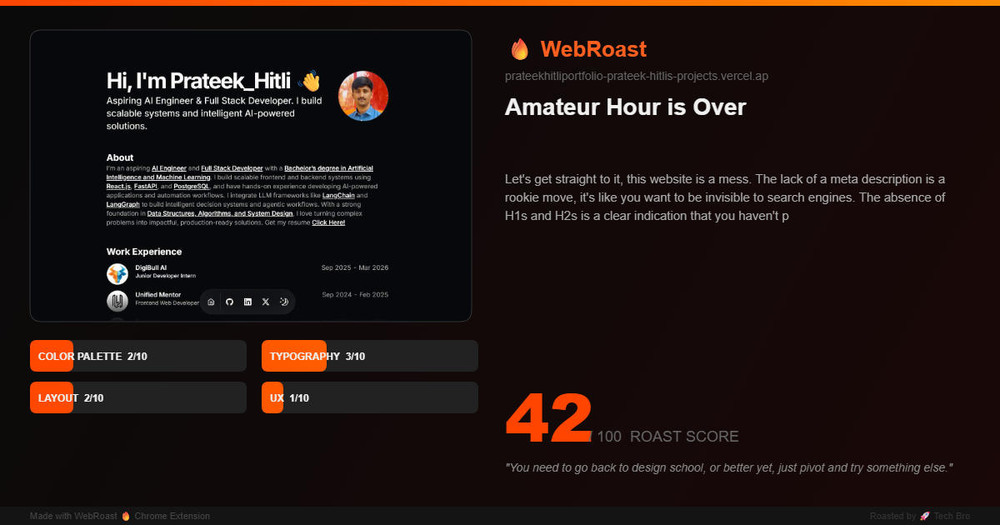

# WebRoast 🔥

**Get any website or social profile savagely roasted by AI.**

WebRoast is a Chrome extension that captures screenshots of websites and social media profiles, extracts page data, and sends it to an AI for a brutally funny roast — complete with scores, verdicts, and downloadable roast cards.

## Screenshot



## Demo

<video src="assets/project demo.mp4" controls width="100%"></video>

> *If the video doesn't play above, download it from [`assets/project demo.mp4`](assets/project%20demo.mp4)*

## Features

- **Multi-persona roasting** — Choose from Gordon Ramsay, Gen Z Critic, or Tech Bro personas, each with a distinct roasting style
- **Smart platform detection** — Automatically detects GitHub profiles/repos, LinkedIn, Twitter/X, and generic websites, extracting platform-specific data
- **Full-page screenshot capture** — Scroll-and-stitch capture (up to 5 viewports) fed to a vision model for visual roast commentary
- **Animated score dashboard** — Animated bar charts and ring score for categories like Cringe Level, Delusion Score, Typography, UX, and more
- **Downloadable roast cards** — Canvas-rendered 1200×630 shareable PNG cards with scores, screenshot, and roast excerpt
- **Roast history** — Stores your last 20 roasts locally with platform icons and scores
- **Copy to clipboard** — One-click copy of the full roast text

## How It Works

1. Navigate to any website or social profile
2. Click the WebRoast extension icon
3. Pick a roaster persona and hit **ROAST THIS**
4. The extension captures a full-page screenshot, extracts page metadata, and sends both to the Groq API
5. A text model generates the roast, then a vision model refines scores based on the actual screenshot
6. View your roast with scores, verdict, and biggest crime — then copy or download the card

## Installation

1. **Get a free Groq API key** at [console.groq.com](https://console.groq.com)
2. Clone or download this repo
3. Open `chrome://extensions` in Chrome
4. Enable **Developer mode** (top right)
5. Click **Load unpacked** and select the project folder
6. Click the WebRoast icon in your toolbar, open Settings, and paste your API key

## Usage

- Click the 🔥 icon on any page
- The current site name, URL, and detected platform are shown automatically
- Select a persona (Gordon Ramsay is the default)
- Hit **ROAST THIS** and wait for the AI to cook
- Use **📋 Copy** to copy the roast text, **🎴 Save Card** to download a shareable PNG, or **🔄 Again** to re-roast

## Supported Platforms

| Platform | What's extracted |
|----------|-----------------|
| **GitHub Profile** | Username, bio, followers/following, repo count, contributions, pinned repos, languages |
| **GitHub Repo** | Description, stars, forks, language, topics, open issues, license, README excerpt |
| **LinkedIn** | Name, headline, location, about, connections, experience, skills, recent posts |
| **Twitter/X** | Display name, bio, followers/following, location, join date, blue tick status, recent tweets |
| **Generic Website** | Title, meta description, headings, body text, image/link/button counts, font, CSS framework detection |

## Personas

| Persona | Style |
|---------|-------|
| 👨‍🍳 **Gordon Ramsay** | Unfiltered fury — "This is RAW!", "Bloody hell!", "Donkey!" |
| 💅 **Gen Z Critic** | Internet slang — "no cap", "it's giving", "mid", "caught in 4K" |
| 🚀 **Tech Bro** | Silicon Valley jargon — "pivot", "synergy", "10x thinking", "disruptive" |

## Tech Stack

- **Chrome Extension Manifest V3** — service worker, content scripts, popup
- **Vanilla JavaScript** — no frameworks, no build step
- **Groq API** — `llama-3.3-70b-versatile` for text roasts, `llama-3.2-90b-vision-preview` for screenshot analysis
- **Canvas API** — full-page screenshot stitching and roast card generation
- **Chrome Storage API** — API key and roast history persistence

## Project Structure

```
webroast/
├── manifest.json              # Extension manifest (MV3)
├── background/
│   └── service-worker.js      # Screenshot capture via chrome.tabs.captureVisibleTab
├── content/
│   └── content.js             # Platform detection & page data extraction
├── popup/
│   ├── popup.html             # Extension popup UI
│   ├── popup.css              # Styling (dark theme, animations)
│   └── popup.js               # Core logic — personas, API calls, rendering, history
└── icons/
    ├── icon16.png
    ├── icon32.png
    ├── icon48.png
    └── icon128.png
```

## Extending

### Add a new persona

Add an entry to the `PERSONAS` object in `popup/popup.js`:

```js
myPersona: {
  name: 'Display Name', emoji: '🎭',
  system: 'You are ... describe the roasting style and tone.',
},
```

Then add a corresponding button in `popup/popup.html`:

```html
<button class="persona-btn" data-persona="myPersona">
  <span class="persona-emoji">🎭</span>
  <span class="persona-name">Display Name</span>
</button>
```

### Add a new platform

1. Add a detection regex in `detectPlatform()` in `content/content.js`
2. Create an `extractMyPlatform()` function returning platform-specific data
3. Wire it into the message listener's `extractData` handler
4. Add the platform context template in `buildPrompt()` in `popup/popup.js`
5. Add label/class mappings in `getPlatformLabel()` and `getPlatformClass()`

## License

MIT
